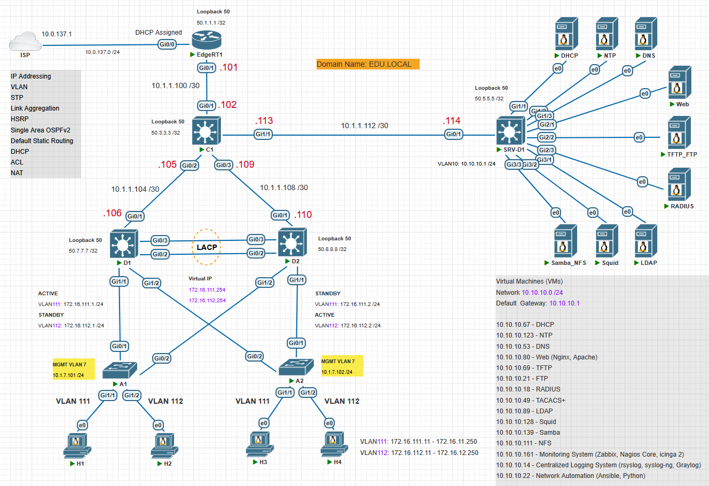

# Cisco-Based Enterprise Network Design and Implementation

### Тақырыбы: Cisco құрылғылары негізінде корпоративті желіні жобалау және конфигурациялау
### Жұмыстың орындалу қадамы: 
  1) VLAN;
  2) Link Aggregation. EtherChannel;
  3) Spanning Tree Protocol (STP);
  4) Switched Virtual Interface (SVI);
  5) HSRP;
  6) IP Address Configuration;
  7) Single area OSPFv2;
  8) Access Control List (ACL);
  9) Network Address Translation (NAT);
  10) Default Static Routing.

> SVI — L3 интерфейс, яғни VLAN-ның виртуалды routed интерфейсі (virtual routed interface)

### Корпоративті желінің топологиясы

[Download Link for PNETLab Topology File](Topology/Topology_PNETLab_EnterpriseNetworkDesign_HQ1_v1_Cisco.zip)

### A1, A2 – Access Layer Switch-ті конфигурациялау
```shell
Switch> enable
Switch# configure terminal

Switch(config)# hostname A1
A1(config)#

A1(config)# vlan 111
A1(config)# vlan 112
A1(config)# do show vlan brief

A1(config)# interface g1/1
A1(config)# switchport mode access
A1(config)# switchport access vlan 111

A1(config)# interface g1/2
A1(config)# switchport mode access
A1(config)# switchport access vlan 112

A1# show vlan brief

A1(config)# interface range g0/1-2
A1(config)# switchport mode trunk
A1(config)# switchport trunk allowed vlan 111,112
A1(config)# switchport nonegotiate

A1# show int trunk
A1# show int status

A1(config)# spanning-tree mode rapid-pvst
A1# show spanning-tree
```

### D1, D2 – Distribution Layer Switch-ті конфигурациялау
```shell
Switch> enable
Switch# configure terminal

Switch(config)# hostname D1
D1(config)# 

D1(config)# vlan 111
D1(config)# vlan 112
D1(config)# do show vlan brief

D1(config)# interface range g1/1-2
D1(config)# switchport trunk encapsulation dot1q
D1(config)# switchport mode trunk
D1(config)# switchport trunk allowed vlan 111,112
D1(config)# switchport nonegotiate

D1# show int trunk
D1# show int status

D1(config)# channel-group 1 mode active

D1(config)# interface port-channel 1
D1(config-if)# switchport trunk encapsulation dot1q
D1(config-if)# switchport mode trunk
D1(config-if)# switchport trunk allowed vlan 111,112
D1(config-if)# switchport nonegotiate

D1# show etherchannel summary

D1(config)# spanning-tree mode rapid-pvst
D1# show spanning-tree

D1(config)# spanning-tree vlan 111 root primary
D1(config)# spanning-tree vlan 112 root secondary

D1(config)# interface vlan111
D1(config)# ip address 172.16.111.1 255.255.255.0
D1(config)# no shutdown
D1(config)# interface vlan112
D1(config)# ip address 172.16.112.1 255.255.255.0
D1(config)# no shutdown

D1(config)# interface vlan111
D1(config)# standby version 2
D1(config)# standby 111 ip 172.16.111.254
D1(config)# standby 111 priority 105
D1(config)# standby 111 preempt

D1(config)# interface vlan112
D1(config)# standby version 2
D1(config)# standby 112 ip 172.16.112.254
D1(config)# standby 112 preempt

D1(config)# interface Loopback 50
D1(config-if)# ip address 50.7.7.7 255.255.255.255

D1(config)# interface g0/1
D1(config-if)# ip address 10.1.1.106 255.255.255.252
D1(config-if)# no shutdown

D1(config)# ip routing
D1(config)# router ospf 1
D1(config-router)# network 50.7.7.7 0.0.0.0 area 0
D1(config-router)# network 10.1.1.104 0.0.0.3 area 0
D1(config-router)# network 172.16.111.0 0.0.0.255 area 0
D1(config-router)# network 172.16.112.0 0.0.0.255 area 0
```

### C1 – Core Layer Switch-ті конфигурациялау
```shell
Switch> enable
Switch# configure terminal

Switch(config)# hostname C1
C1(config)#

C1(config)# interface Loopback 50
C1(config-if)# ip address 50.3.3.3 255.255.255.255

C1(config)# interface g0/1
C1(config-if)# ip address 10.1.1.102 255.255.255.252
C1(config-if)# no shutdown

C1(config)# interface g0/2
C1(config-if)# ip address 10.1.1.105 255.255.255.252
C1(config-if)# no shutdown

C1(config)# interface g0/3
C1(config-if)# ip address 10.1.1.109 255.255.255.252
C1(config-if)# no shutdown

C1(config)# interface g1/1
C1(config-if)# ip address 10.1.1.113 255.255.255.252
C1(config-if)# no shutdown

C1(config)# ip routing
C1(config)# router ospf 1
C1(config-router)# network 50.3.3.3 0.0.0.0 area 0
C1(config-router)# network 10.1.1.100 0.0.0.3 area 0
C1(config-router)# network 10.1.1.104 0.0.0.3 area 0
C1(config-router)# network 10.1.1.108 0.0.0.3 area 0
C1(config-router)# network 10.1.1.112 0.0.0.3 area 0
```

### EdgeR1 – Edge Router-ді конфигурациялау
```shell
Router> enable
Router# configure terminal

Router(config)# hostname EdgeR1
EdgeR1(config)# 
```
